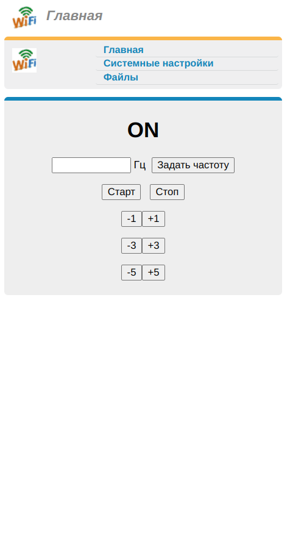
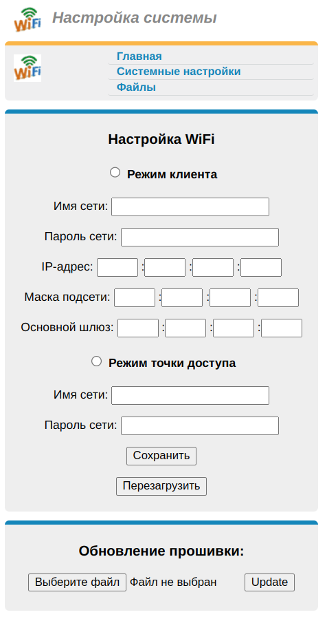

## ESP8266-pulse-generator
### Генератор импульсов заданной частоты
---  
#### Функционал устройства:
Контроллер генерирует импульсы заданной частоты на выходе GPIO14 (D5)

#### Управление и настройка контроллера:
Управление кортроллером может выполняться через веб-интерфейс из любого браузера.

- контроллер может работать в режиме WIFI-точки доступа;
- контроллер может работать в режиме WIFI-клиента для подключения к роутеру;
- автозапуск в режиме WIFI-точки доступа "По умолчанию" с настройками по умолчанию (для первичной настройки устройства);

Страницы для управление через веб-интерфейс:
- Страница управления и настройки реле (/index.htm);
- Страница сетевых настроек (/setup.htm);

|  |  |
|:---------:|:---------:|

#### Используемые технологии:
- Web сервер (порт: 80) на устройстве для подключения к устройству по сети из любого web-браузера;
- Websocket сервер (порт: 81) на устройстве для обмена коммандами и данными между страницей в web-браузере и контроллером;

#### Подключение к выводам контроллера (для платы типа ESP8266 nodeMCU):
- GPIO2 (D4) - голубой wifi светодиод;
- GPIO4 (D2) - кнопка, подключена к пину (для платы типа ESP8266 nodeMCU);
- GPIO14 (D5) - выход импульсов.
